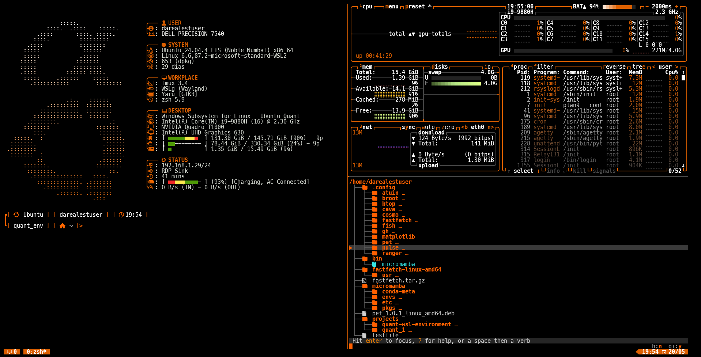
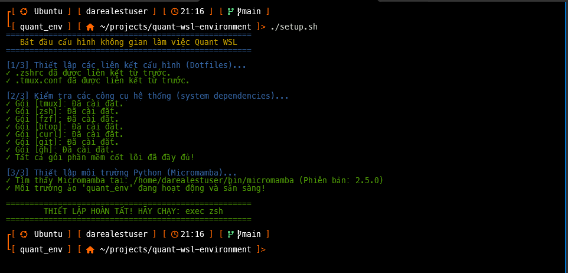

# Quant WSL Environment

## What is this?

A high-performance development workspace optimized for quantitative finance and data science on WSL2 Ubuntu.

## What's included?

- **Production-ready terminal**: Zsh, Tmux, and system tools pre-configured for seamless workflow
- **Python 3.12 environment**: Pre-built with libraries for data ingestion (vnstock, yfinance), modeling (statsmodels, arch), and backtesting (vectorbt, quantstats)

## Workspace Preview

### 2. Không gian làm việc thực tế (Tmux + Code + Btop)


## Architecture

The workspace is split into two clean layers to ensure reproducibility and keep the host system isolated:

### 1.Tree Map Overview
```
quant-wsl-environment/
├── OS-Level Tools (APT)
|   |
│   ├── zsh          # Shell cấu hình cao, hỗ trợ plugins & themes
│   ├── tmux         # Trình quản lý đa màn hình terminal (Multiplexer)
│   ├── fzf          # Bộ lọc tìm kiếm nhanh dữ liệu/lịch sử lệnh (Fuzzy Finder)
│   ├── btop         # Giao diện theo dõi hiệu năng phần cứng (CPU, RAM, Disk)
│   ├── gh (GitHub)  # Công cụ quản lý và tương tác với repo ngay từ CLI
│   └── curl & git   # Các công cụ cốt lõi để tải dữ liệu và quản lý mã nguồn
| 
└── Quant Virtual Env (Micromamba)
    |
    ├── Data Ingestion & Scraping
    |   |
    │   ├── vnstock        # Truy xuất dữ liệu chứng khoán Việt Nam (Real-time & Historical)
    │   ├── yfinance       # Tải dữ liệu tài chính quốc tế từ Yahoo Finance
    │   └── beautifulsoup4 # Cào dữ liệu cấu trúc (Web scraping) từ các trang tin tức
    |
    ├── Analytics & Statistical Modeling
    │   ├── pandas         # Thao tác và biến đổi dữ liệu chuỗi thời gian (Time-series)
    │   ├── numpy          # Tính toán đại số tuyến tính và xử lý ma trận tốc độ cao
    │   ├── statsmodels    # Kiểm định thống kê, hồi quy tuyến tính (OLS), mô hình ARIMA
    │   └── arch           # Khởi dựng các mô hình biến động tài chính (GARCH, EGARCH)
    |
    └── Backtesting & Execution
        ├── vectorbt       # Backtesting hệ thống giao dịch quy mô lớn dựa trên Vectorization
        └── quantstats     # Đánh giá hiệu suất danh mục (Sharpe Ratio, Win Rate, Drawdown)
```

### 2.Detail Environment's component list

| Phân nhóm | Tên công cụ / Thư viện | Vai trò cụ thể trong Quant Workflow |
| :--- | :--- | :--- |
| **Hệ thống (OS Tools)** | zsh + tmux | Tạo không gian làm việc đa nhiệm, chia đôi màn hình để vừa viết mã vừa theo dõi hệ thống. |
| | btop | Giám sát tài nguyên máy tính (CPU/RAM) khi chạy các thuật toán backtest nặng. |
| | fzf | Tìm kiếm nhanh các file dữ liệu .csv, .parquet hoặc lịch sử lệnh chỉ với một vài ký tự bấm. |
| **Thu thập dữ liệu <br>(Data Ingestion)** | vnstock | Đầu mối chính để lấy dữ liệu OHLCV, Order Book của thị trường tài chính Việt Nam. |
| | yfinance | Thu thập dữ liệu các cặp tỷ giá (XAUUSD, EURUSD) và cổ phiếu quốc tế phục vụ Statistical Arbitrage. |
| | beautifulsoup4 | Khai thác dữ liệu phi cấu trúc (tin tức vĩ mô, báo cáo tài chính) từ các diễn đàn, trang web. |
| **Phân tích dữ liệu <br>(Math & Analytics)** | pandas + numpy | Làm sạch dữ liệu, xử lý các điểm khuyết thiếu (NaN), tính toán các đường chỉ báo kỹ thuật (MA, RSI). |
| | statsmodels | Thực hiện các kiểm định đồng tích hợp (Cointegration test) phục vụ chiến lược giao dịch cặp (Pair Trading). |
| | arch | Phân tích và dự báo độ biến động (Volatility clustering) của thị trường nhằm quản trị rủi ro tối ưu. |
| **Kiểm thử chiến lược <br>(Backtesting)** | vectorbt | Thực thi kiểm thử chiến lược trên hàng triệu chuỗi dữ liệu trong vài giây nhờ tận dụng sức mạnh của Numba. |
| | quantstats | Xuất báo cáo trực quan dưới dạng biểu đồ (Tear sheet) với các chỉ số Sharpe, Sortino, Max Drawdown. |


## Featured Tooling Stack

### 1. Terminal & Workspace Productivity

- **Zsh & Multi-plugins**: Configured with syntax highlighting, auto-suggestions, and customized prompts for high-speed terminal navigation.

- **Tmux (Warm Accent Theme)**: Optimized for multi-tasking, allowing seamless splitting of sessions between scraping scripts, running backtests, and system monitoring.

- **Fzf & Btop**: Interactive fuzzy searching and modern real-time system resource management.

### 2. Quantitative & Data Science Stack (Python 3.12)

Managed efficiently via Micromamba for blazing-fast environment resolution:

- **Backtesting & Evaluation**: 
  - vectorbt for matrix-based, high-performance vectorized backtesting
  - quantstats for portfolio risk metrics (Sharpe, Sortino, Max Drawdown)

- **Financial Modeling & Analytics**: 
  - statsmodels (Econometrics & Cointegration)
  - arch (GARCH models for volatility clustering)
  - pandas-ta (Technical analysis indicators)

- **Data Sources**: 
  - vnstock for seamless Vietnamese market financial data ingestion
  - yfinance for global assets (Forex, XAUUSD, Crypto)

- **Core Machine Learning**: 
  - scikit-learn and scipy for statistical and clustering models

## Quick Start & Installation

Follow these steps to deploy the workspace on a fresh or existing WSL2 Ubuntu distribution.

### Step 1: Clone the Repository

```bash
git clone https://github.com/your-username/quant-wsl-environment.git
cd quant-wsl-environment
```

### Step 2: Run the Automation Setup Script

Execute the bundled script to link your dotfiles, audit system packages, and build the Python environment automatically:

```bash
chmod +x setup.sh
./setup.sh
```

### setup environment log preview (`setup.sh`)


### Step 3: Apply Changes & Verify

Reload your terminal session to step into your new workspace and verify the active environment:

```bash
exec zsh
micromamba activate quant_env
micromamba list
```

## Security & Privacy Practices

- **Zero Hardcoded Credentials**: No API Keys (e.g., Binance, Vietstock) or Git tokens are tracked in this repository.

- **Strict Git Filtering**: Local databases, backtest caches (`.ipynb_checkpoints`, `__pycache__`), and large data assets (`.csv`, `.parquet`) are strictly filtered out via `.gitignore` to prevent repository bloating and data leaks.

## License

Distributed under the MIT License. See LICENSE for more information.